Команда РПО

Ссылка на проект: https://kanban-pumpkin.ru

Тестовое окружение: браузер Google Chrome версии 136

## Распределение участников

1-5: Костя

6-10: Валентин

11-15: Ксюша

16-20: Георгий

Нефункциональные и валидация - все вместе

Надо:

- Сделать тесткейсы;
- Если баг найден, в раздел "Баг-репорты" в соответствующий блок внести информацию о нём;
- Сделать кросс-ссылку на баг на том кейсе.

Заголовок писать так: `<h4 id="...">Название-бага</h4>`. ID должен состоять из 3-4 цифр. Первые 1-2 цифры - номер тестируемого
блока. Следующие две цифры - номер бага в этом блоке.

Например, если это третий баг в блоке 7, ID должен быть равен 703.

## Сценарий тестирования

### 1. Регистрация/авторизация

Тестирование в браузере Mozilla Firefox

<b>1.1 Регистрация нового пользователя</b>

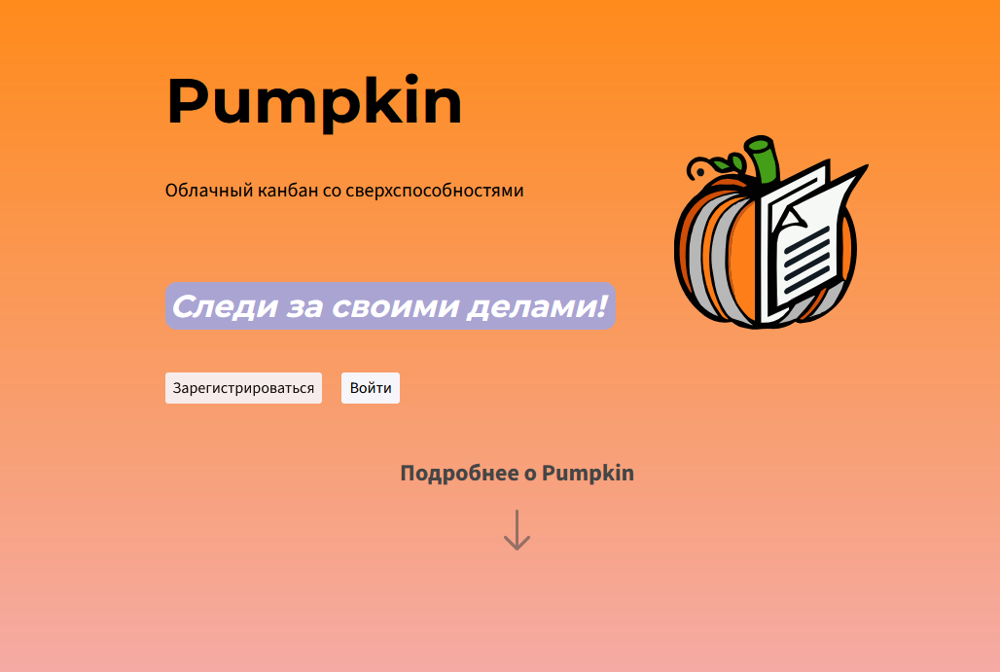

- Зайти на сайт https://kanban-pumpkin.ru/
- На открывшейся странице найдите кнопку "Зарегистрироваться"
- Нажать кнопку "Зарегистрироваться"
- Открывается попап для регистрации на сайте
- Заполнить форму (тестовые данные, представленые ниже <b>ТЕПЕРЬ зарегистрированы в системе</b>)
  - Никнейм: **_Mikhail_**
  - Email: ***mikhail@mail.ru***
  - Пароль: **_Misha1999!_**
  - Повторите пароль: **_Misha1999!_**
  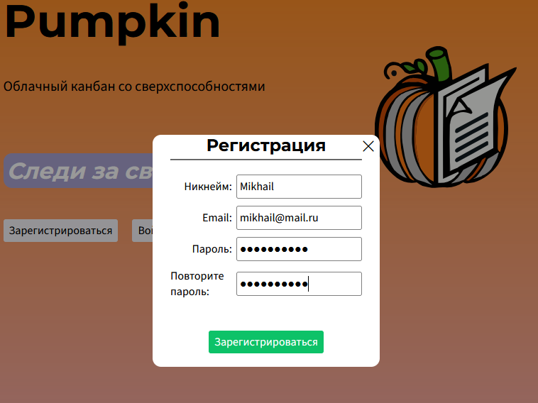
- Нажать кнопку "Зарегистрироваться" (Становится активной и загорается зеленым при корректном заполнении всех полей)
- Пользователь автоматически попадает на пустую страницу работы с досками https://kanban-pumpkin.ru/app - надпись по центру экрана "Чтобы приступить к работе, выберите доску в левом меню"
- В правом нижнем углу появляется сообщение на зеленом фоне "Успешная регистрация"

---

<b>1.2 Авторизация зарегистрированного пользователя (не вошел еще в систему)</b>

- Зайти на сайт https://kanban-pumpkin.ru/
- На открывшейся странице найдите кнопку "Войти"
- Нажать кнопку "Войти"
- Открывается попап для авторизации на сайте
- Заполнить форму (тестовые данные представлены ниже)
  - Email: ***mikhail@mail.ru***
  - Пароль: **_Misha1999!_**
- Нажать кнопку "Войти" (Становится активной и загорается зеленым при корректном заполнении всех полей)
- Пользователь автоматически попадает на пустую страницу работы с досками https://kanban-pumpkin.ru/app - надпись по центру экрана "Чтобы приступить к работе, выберите доску в левом меню"
- В правом нижнем углу появляется сообщение на зеленом фоне "Успешная регистрация"
- В правом верхнем отображается аватар пользователя

---
<b>1.3 Негативный сценарий авторизации зарегистрированного пользователя (некорректные данные)</b>

- Пользователь переходит на сайт `https://kanban-pumpkin.ru/`.
- На главной странице пользователь находит кнопку "Войти".
- Пользователь нажимает кнопку "Войти".
- На экране появляется попап для авторизации.
- Пользователь вводит некорректные данные:
  - **Email:** `mikhail@mail.ru` (корректный email, но не соответствующий паролю).
  - **Пароль:** `Misha1998!` (неверный пароль).
- Пользователь нажимает кнопку "Войти!".
- Появляется сообщение об ошибке на красном фоне: "Неверные учетные данные".
- Пользователь остается на странице авторизации, попап не закрывается.
  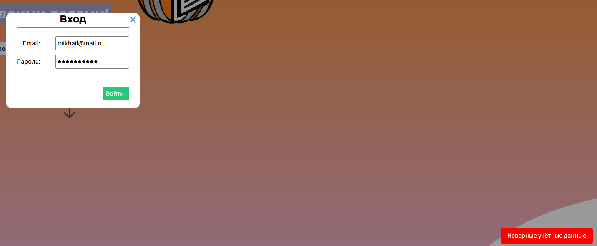

---

<b>1.4 Негативный сценарий авторизации (незаполненные поля)</b>

- Пользователь переходит на сайт `https://kanban-pumpkin.ru/`.
- На главной странице пользователь находит кнопку "Войти".
- Пользователь нажимает кнопку "Войти".
- На экране появляется попап для авторизации.
- Пользователь оставляет поля пустыми:
  - **Email:** пусто.
  - **Пароль:** пусто.
- Пользователь нажимает кнопку "Войти!".
- Появляется сообщение об ошибке на красном фоне: "Вы заполнили не все поля".
- Попап не закрывается, авторизация не происходит.
 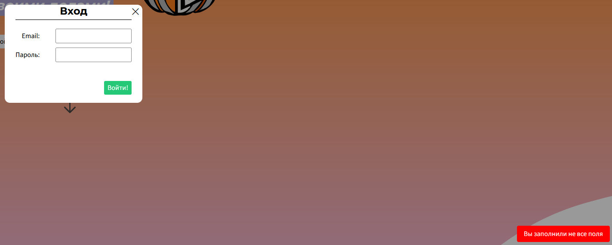

---

<b>1.5 Негативный сценарий авторизации (неверный формат email)</b>

- Пользователь переходит на сайт `https://kanban-pumpkin.ru/`.
- На главной странице пользователь находит кнопку "Войти".
- Пользователь нажимает кнопку "Войти".
- На экране появляется попап для авторизации.
- Пользователь вводит данные:
  - **Email:** `mikhailmail.ru` (неверный формат email).
  - **Пароль:** `Misha1999!` (корректный пароль).
- Пользователь нажимает кнопку "Войти!".
- Появляется сообщение об ошибке на красном фоне: "Неверные учетные данные".
- Пользователь остается на странице авторизации, попап не закрывается.
 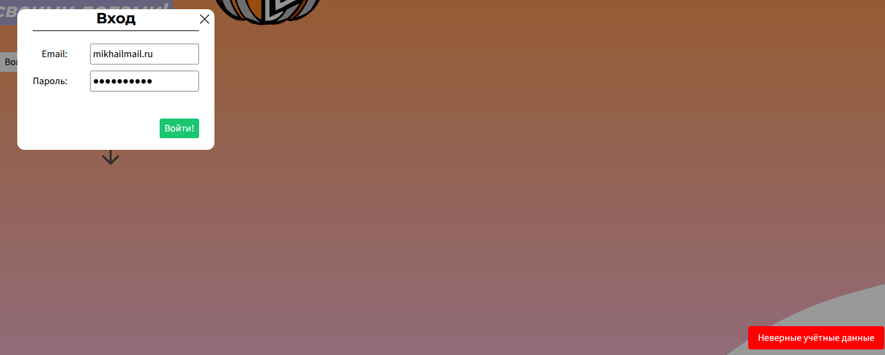

---

<b>1.6 Тестирование ошибок при регистрации нового пользователя</b>

- Зайти на сайт https://kanban-pumpkin.ru/
- На открывшейся странице найдите кнопку "Зарегистрироваться"
- Нажать кнопку "Зарегистрироваться"
- Открывается попап для регистрации на сайте
  - Тестирование полей
    - Нажать кнопку "Зарегистрироваться" без заполнения полей
      - Результат: сообщение _Ошибка в форме регистрации_
    - Ввести уже зарегистрированный email
      - Результат: сообщение _Email занят_
    - Ввести уже зарегистрированный никнейм
      - Результат: сообщение _Никнейм занят_
    - Введите разные пароли в поля "Пароль" и "Подтверждение пароля"
      - Результат: _Пароли не совпадают_
    - Введите некорректный формат email `mikhailmail.ru` или `mikhail@mailru`
      - Результат: _Некорректный email_
    - Введите некорректный формат пароля - слишком короткий, строчными буквами, без цифр, без спецсимволов (например, !, @, # и т.д.)`lj`
      - Результат: _должен быть не менее 8 символов, должен содержать заглавную и строчную латинские буквы, должен содержать цифру, должен содержать специальный символ_ [найден баг - Ошибка в отображаемом тексте](#101)</a>
    - Введите слишком длинное имя пользователя (боле 20 символов) `MikhailMikhailMikhailM`
      - Результат: _Не более 20 символов_


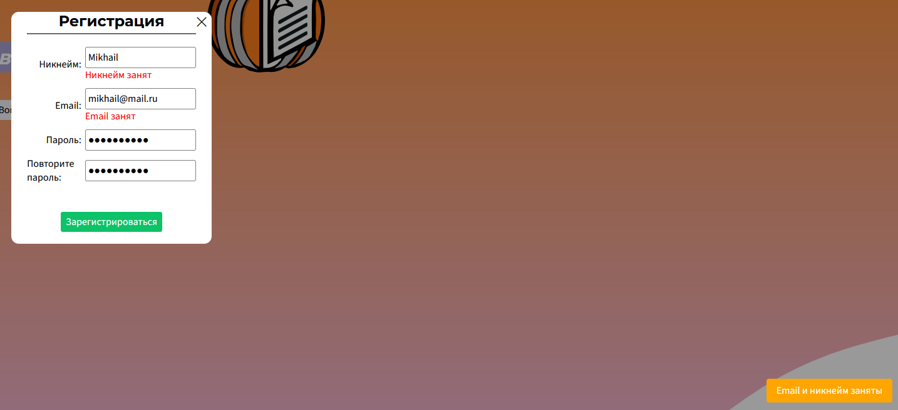

---

### 2. Доступ к карточке по ссылке

- Зайти на существующую доску с заранее созданной карточкой в колонке

- Нажать на карточку
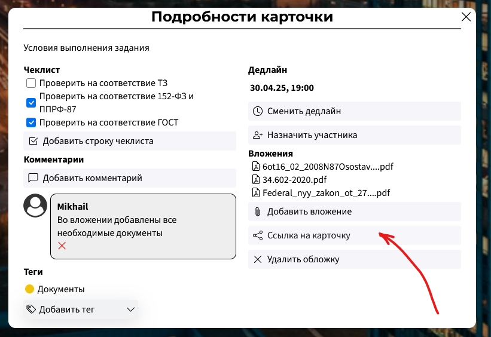

- [ ] При нажатии на кнопку "Ссылка на карточку" администратор доски создает ссылку для просмотра конкретной карточки, которая появляется в текстовом поле

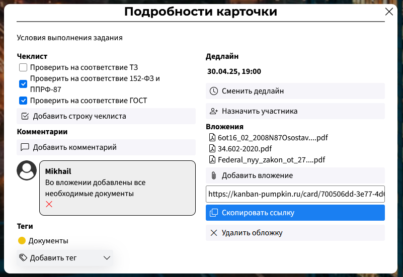

- [ ] Пользователь, создавший ссылку, может скопировть ее вручную из текстового поля

- [ ] Пользователь, создавший ссылку, может скопировать ее нажатием на появившуюся синюю кнопку "Скопировать ссылку"

- [ ] Пользователь "Зритель" доски может посмотреть конкретную карточку по ссылке на карточку

- [ ] Пользователь, не имеющий доступа к доске, может просмотреть карточку по ссылке на карточку [найден баг - Ошибка в отображении тегов](#201)</a>

### 3. Drag-n-Drop
- [ ] Работает перемещение карточки в рамках одной колонки [найден баг - Ошибка при захвате карточки и попытке постаить ее на исходное место](#301)</a>

- [ ] Работает перемещение карточки между разными столбцами

- [ ] Работает перемещение столбцов


### 4. Назначить пользователя на карточку
Каждый пользователь доски может иметь одну из нескольких ролей: `Редактор`, `Зритель`, `Редактор-организатор`, `Администратор`.<br>
<b>Права пользователей</b>

`Редактор` - может добалять колонки, добавлять/удалять/редактировать карточки<br>
`Зритель` - имеет возможность только просматривать материалы доски и карточек, без возможности их редактирования<br>
`Редактор-организатор` - может добалять колонки, добавлять/удалять/редактировать карточки, добавлять новых пользователей в доску<br>
`Администратор` - может добалять колонки, добавлять/удалять/редактировать карточки, добавлять новых пользователей в доску, может редактировать/удалять доску.<br>

Чтобы назначить пользователя на карточку, необходимо:
- зайти на сайт `https://kanban-pumpkin.ru/`
- Войти в свою учетную запись/зарегистрироваться/перейти в приложение
- Вызвать список досок, нажав на кнопку меню "бургер" в левом верхнем углу экрана
- Зайти в доску, в которой данный пользователь является Администратором/Редактором/Редактором-организатором
- Нажать на карточку для того, чтобы отредактировать ее и посмотреть подробности (при необходимости заранее создать)
- Нажать на кнопку "Назначить участника"

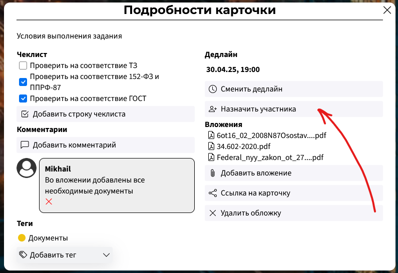

- Ввести в появившемся текстовом поле никнейм пользователя
- Нажать на появившуюся синюю кнопку "Назначить участника"

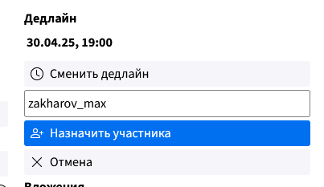


- [ ] Администратор доски может назначить любого участника доски на карточку

- [ ] Редактор доски может назначить любого участника доски на карточку

- [ ] Нельзя назначить на карточку пользователя, который не является участником доски

- [ ] Администратор или редактор могут удалять назначенных пользователей из карточки [найден баг - Удаление последнего назначенного лица из карточки](#401)

### 5. Полнотекстоввый поиск

- [ ] Полнотекстовый поиск позволяет находить карточки по совпадению слов в их названии в Канбан'е

- [ ] Полнотекстовый поиск позволяет находить карточки по совпадению слов в их названии в Списке

- [ ] Удалённая карточка не выходит в результатах

- [ ] Если изменить карточку, то изменения повлияют на результаты поиска

### 6. Добавление участников на доску (по ссылке)

- [ ] При клике по кнопкe "Создать ссылку-приглашение" в модальном окне "Настройки доски" создается ссылка


- [ ] При переходе по ссылке-приглашению происходит редирект на сайт и открывается модальное окно

   

- [ ] В открывшемся модальном окне "Приглашение на доску" отображается название доски


- [ ] В открывшемся модальном окне "Приглашение на доску" отображается задний фон доски


- [ ] При нажатии на кнопку "Отмена" модальное окно "Приглашение на доску" закрываетя


- [ ] При нажатии на кнопку "Присоединиться" в модальное окно "Приглашение на доску" закрывается и открывается доска, на которую было отправлено приглашение


- [ ] Для пользователя данной доски с правами "Админ" и "Редактор-организатор" доступно создание ссылкии


- [ ] Для пользователя данной доски с правами "Зритель" и "Редактор" недоступно создание ссылки


### 7. Чеклист

- [ ] При клике по кнопке "Добавить чеклист" в модальном окне "Подробности карточки" появляется поле для ввода названия строки, кнопка "Добавить строку чеклиста" и кнопка "Отмена"


- [ ] При вводе меньше 3 символов для названия чеклиста нельзя создать чеклист


- [ ] При вводе больше 30 символов нельзя добавить чеклист [найден баг](#701)</a>

- [ ] При нажатии на кнопку "Отмена" при создании чеклиста, поле для ввода и кнопка "Отмена" пропадают


- [ ] При нажатии на кнопку "Добавить строку чеклиста" чеклист добавляется


- [ ] При перезагрузке страницы чекбокс карточки не пропадает


- [ ] При нажатии на чекбокс он закрашивается в синий и внутри него появляется белая галочка


- [ ] При нажатии на кнопку "крестик" в чеклисте, чеклист удаляется


- [ ] При добавлении большого количество чеклистов появляется скролл


### 8. Режим списка, переключалка

- [ ] При выборе режима списка доска переключается в режим списка


- [ ] При нажатии на карточку открывается модальное окно карточки


### 9. Вложения

- [ ] При нажатии на кнопку "Добавить вложение" открывается Проводник для выбора файла


- [ ] Файлы-вложения успешно добавляются


- [ ] При нажатии на добавленный файл начинается открывается Проводник для выбора места сохранения


- [ ] При выборе места сохранения файла в Проводнике начинается загрузка файла


- [ ] При нажатии на кнопку "Мусорка" вложение успешно удаляется


### 10. Доски (левая панель)

- [ ] При нажатии на "бургер" левая панель доски открывается


- [ ] При клике на "крестик" в открывшейся левой панели, левая панель закрывается


- [ ] При выборе доски из списка досок в левой панели, выбранная доска открывается


- [ ] При нажатии на кнопку "Добавить доску" появляется поле для ввода названия доски, кнопка "Добавить доску" и кнопка "Отмена"


- [ ] При вводе меньше 3 символов в поле для названия доски кнопка "Добавить доску" должно появиться Toast-сообщение "Название доски должно быть не меньше 3 символов"


 
- [ ] При вводе больше 30 символов в поле для названия доски кнопка "Добавить доску" должно появиться Toast-сообщение "Название доски должно быть не больше 30 символов"


- [ ] При вводе от 3 до 30 символов в поле для названия доски и нажатии на кнопку "Добавить доску" доска успешно создается (отображается в левой панели)


- [ ] При нажатии на кнопку отмена пропадает поле для ввода и сама кнопка "Отмена"


### 11. Комментарии
- [ ] При нажатии на кнопку добавить комментарий открывается полее ввода и кнопки добавления комментария и отмены.
- [ ] При корректном вводе комментарий успешно добавляется и отображается [найден баг](#1101)</a> [найден баг](#1102)</a>
- [ ] При некорректном вводе выводится ошибка и комментарий не добавляется.
- [ ] При нажатии на кнопку отмены комментарий не добавлется.
### 12. Назначение тега на карточку
- [ ] Настройка тегов доски. При вводе данных не проходящих валидацию выводится соответствующая ошибка.
- [ ] Настройка тегов доски. При корректном вводе тег корректно отображается в списке.  [найден баг](#1201)</a>
- [ ] При удалении тега с доски тег исчезает из списка доступных тегов и всех досок, где он был зареплен. Выводится соответствующее уведомление
- [ ] При отсутствии тегов в списке видна заглушка "На доске нет тегов"
- [ ] Из списка тегов доски выбирается успешно выбирается и назначается тег.  [найден баг](#1202)</a>

### 13. Смена аватарки пользователя
- [ ] Зайти в настройки пользователя.
- [ ] Нажать на кнопку "Сменить аватарку"
- [ ] В появившемся окне выбрать необходимый файл.
- [ ] Аватарка успешно меняется и корректно отображается [найден баг](#1301)</a> [найден баг](#1302)</a> [найден баг](#1303)</a>

### 14. Создание, изменение и удаление колонок и карточек
- [ ] При нажатии на кнопку "Добавить карточку" появляются поле ввода кнопка добавления и отмены.
- [ ] При некорректных данных выводится соответвующая ошибка. [найден баг](#1401)</a>    [найден баг](#1407)</a>
- [ ] После создания новая карточка появляется в колонке
- [ ] При редактировании данных текст корректно изменяется [найден баг](#1402)</a>
- [ ] После удаления карточка исчезает с доски [найден баг](#1403)</a>
- [ ] Колонка корректно создается и отображается
- [ ] Колонка корректно редактируется при нажатии на название [найден баг](#1404)</a> [найден баг](#1405)</a> [найден баг](#1406)</a>
- [ ] Колонка корректно удаляется  при нажатии на иконку мусорки

### 15. Задание фона доски
- [ ] Зайти в настройки доски
- [ ] Нажать на кнопку "Сменить фон"
- [ ] В появившемся окне выбрать необходимый файл.
- [ ] Фон успешно изменился на выбранную картинку. Вышло уведомление об успешном изменении <a>[найден баг](#1501)</a> [найден баг](#1502)</a> [найден баг](#1503)</a>

### 16. Управление тегами

- [ ] При нажатии на кнопку "Настроить теги" в настройках доски открывается модальное окно

- [ ] Если на доске нет тегов, в окне "Настроить теги" отображается заглушка "На доске нет тегов!"

- [ ] При нажатии на кнопку "Добавить тег" появляется поле ввода и две кнопки: "Добавить" и "Отменить"

- [ ] При нажатии на кнопку "Отменить" поле ввода закрывается, и остаётся только кнопка "Добавить тег"

- [ ] При попытке создать тег длиной менее 3 символов появляется Toast-сообщение с текстом:
"Название тега не меньше 3 символов"

- [ ] При попытке создать тег длиной 31 символ появляется Toast-сообщение с текстом:
"Название тега не больше 30 символов"

- [ ] Добавить тег можно как по нажатию кнопки "Добавить", так и по нажатию клавиши Enter.
При этом при добавлении закрывается поле ввода, а тег сразу появляется в списке доступных.
Также при добавлении отображается Toast-сообщение "Успешно добавлен тег!"
После перезагрузки тег остаётся в списке
[найден баг]

- [ ] В списке тегов слева от каждого тега отображается кружочек с цветом. Каждый тег имеет
уникальный цвет. Все цвета достаточно яркие, выделяются на фоне background-а модального окна. Для проверки следует создать около 10 тегов

- [ ] Если создать настолько много тегов, что список не будет помещаться на экране по высоте, у
окна "Настройки тегов" появится скроллбар, с помощью которого можно будет просматривать все теги
и без проблем создавать новые

- [ ] При наведении курсора на строку с тегом отображается кнопка в форме мусорки. При нажатии на
неё тег удаляется и показывается Toast-сообщение с текстом "Успешно удалён тег!".
Тег пропадает из списка без перезагрузки страницы. После перезагрузки он не возвращается

### 17. Дедлайн карточки

В сервисе есть возможность задания дедлайна для карточки. Это необходимо для отслеживания сроков выполнения задачи.

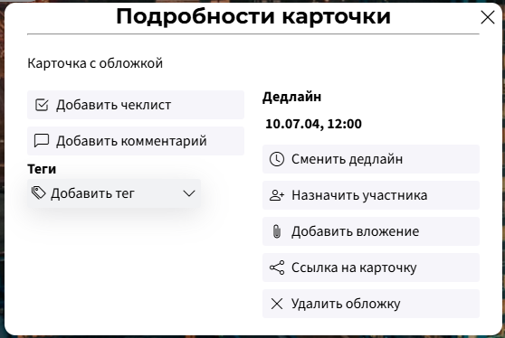

- [ ] В окне "Подробности карточки" у только что созданной карточки должна быть кнопка
"Добавить дедлайн". При нажатии на неё должно появиться поле ввода и две кнопки: "Задать" и "Отмена"

- [ ] При нажатии на кнопку "Отмена" интерфейс должен вернуться в такое состояние, которое было до
нажатия на кнопку "Добавить дедлайн"

- [ ] При нажатии на кнопку "Задать" и пустом (или неполном) вводе должно отобразиться Toast-сообщение с ошибкой
[найден баг](#1701)

- [ ] При нажатии на кнопку "Задать" при вводе адекватной даты (например, сегодняшней) появляется поле "Дедлайн". Там отображается та же временная метка, что и была введена в поле.
Также появляется Toast-сообщение с успехом. После перезагрузки страницы дедлайн остаётся.

- [ ] При нажатии на кнопку "Сменить дедлайн" смена дедлайна работает корректно, при смене отображается
Toast-сообщение. Изменение дедлайна должно отобразиться без перезагрузки, также оно должно не слететь
после перезагрузки

- [ ] Если у карточки есть дедлайн, на карточке в канбан-колонке должны отображаться "часики" - признак
того, что дедлайн задан. Часики отображаются сразу после задания/удаления дедлайна,
без перезагрузки страницы

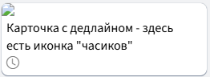

- [ ] При наведении на строчку дедлайна она подсвечивается, и в правой части строчки появляется
красный крестик. При нажатии на него дедлайн удаляется, также появляется Toast-сообщение.
Дедлайн сразу пропадает из меню "Подробности карточки" и не возвращается после перезагрузки
[найден баг](#1702)

### 18. Обложка карточки

Каждой карточке можно назначить обложку. Это позволяет выделить карточку на фоне других карточек, добавив уникальный визуальный стиль. Обложка должна быть вписана в карточку.

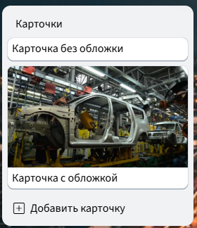

- [ ] При открытии подробностей у только что заданной карточки там содержится кнопка "Добавить обложку".
При нажатии на неё открывается интерфейс выбора файла

- [ ] В интерфейсе выбора файла сделан фильтр на изображения; нельзя выбрать другой тип файла, например, txt

- [ ] При выборе в качестве обложки растрового изображения размером не более 10 Мб обложка устанавливается.
При этом она без перезагрузки становится видна на канбан-доске. Также появляется Toast-сообщение.
Также кнопка "Добавить обложку" изменяется на "Удалить обложку"

- [ ] Если открыть карточку, у которой есть обложка, отображается "Удалить обложку". Не отображается кнопка "Добавить обложку"

- [ ] При нажатии на кнопку "Удалить обложку" обложка сразу удалится с доски. Кнопка "Удалить обложку"
заменится на "Добавить обложку". После перезагрузки обложка не вернётся

- [ ] При попытке установить в качестве обложки не изображение или повреждённый файл изображения система
показывает Toast-сообщение об ошибке и не назначает такую обложку
[найден баг](#1801)

- [ ] При попытке установить в качестве обложки файл размером более 10 Мб система выдаёт ошибку в виде
Toast-сообщения
[найден баг](#1801)

### 19. Переименование доски

Название доски находится в верхней панели, примерно по центру экрана. Справа от него находится кнопка с шестерёнкой


- [ ] При нажатии на название доски текст с названием заменяется на поле ввода, в котором это название
уже введено. На это поле автоматически падает фокус. Каретка находится в конце этого названия

- [ ] При вводе текста в это поле ширина поля автоматически подстраивается под длину текста.
Автоматическое изменение ширины происходит после каждого ввода/удаления символа

- [ ] Потеря полем фокуса или нажатие Enter означает подтверждение ввода. Если текст изменился и новый текст по длине не меньше 3 и не больше 30 символов, отображается Toast-сообщение с информацией об успехе.
[найден баг](#1901)

- [ ] Если текст оказался меньше 3 символов или больше 30 символов, он не принимается. Система показывает Toast-сообщение. Также система возвращает предыдущее название доски

- [ ] При отсутствии изменений в поле запрос не отправляется на сервер. [найден баг](#1902)

### 20. Настройки профиля

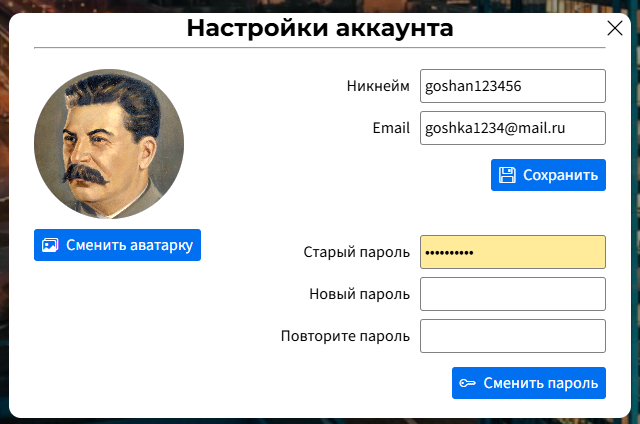

- [ ] При нажатии на аватарку на навбаре в правом верхнем углу экрана открывается контекстное меню. Это меню
содержит пункты: "Помощь", "Настройки аккаунта", "Выйти"

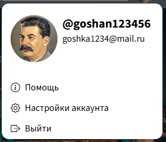

- [ ] При клике вне этого контекстного меню оно закрывается

- [ ] При выборе пункта "Помощь" открывается ссылка с контактами технической поддержки

- [ ] При выборе пункта "Выйти" происходит логаут. Сессионная кука удаляется. Это следует проверить
в инструментах разработчика. Также после нажатия на эту кнопку система отправляет пользователя на главную страницу сайта

- [ ] При выборе пункта "Настройки аккаунта" открывается окно с настройками. Там отображаются три секции:
для смены аватарки, для смены никнейма/email и для смены пароля

- [ ] При открытии окна "Настройки аккаунта" в поля "Никнейм" и "Email" автоматически подставляются актуальные для данного пользователя значения

#### Смена аватарки

- [ ] При нажатии на кнопку "Сменить аватарку" появляется меню выбора файла, где настроен фильтр на изображения. Файлы других расширений не показываются в интерфейсе

- [ ] При выборе в качестве аватарки растрового изображения размером не более 10 Мб новая аватарка без перезагрузки
отобразится в интерфейсе (в окне настроек и на навбаре). Также показывается Toast-сообщение

- [ ] При выборе в качестве аватарки файла размером более 10 Мб аватарка не назначается. Показывается Toast-сообщение с ошибкой
[найден баг]

- [ ] При выборе в качестве аватарки не изображения или повреждённого файла аватарка не назначается.
Показывается Toast-сообщение с ошибкой
[найден баг]

#### Смена пароля

- [ ] При корректном вводе старого пароля и [надёжном](#validation_password) новом пароле происходит смена пароля. При этом
отменяются все сессии этого пользователя, кроме активной. Показывается Toast-сообщение об успешной смене пароля.
Критерии надёжности пароля см. в правилах валидации. Для проверки этого пункта необходимо открыть браузер в
режиме Инкогнито, войти под тем же аккаунтом, из основного браузера сменить пароль, перейти в режим инкогнито и
обновить страницу. Сессия в инкогнито становится неактивной.

- [ ] При некорректном вводе старого пароля показывается Toast-сообщение с ошибкой

- [ ] При несовпадении паролей в полях "Новый пароль" и "Подтвердите пароль" показывается Toast-сообщение

- [ ] При несоответствии нового пароля критериям надёжности показывается Toast-сообщение. В нём
перечислены все пункты, которым не соответствует введённый пароль. Смена пароля не производится
[найден баг]

#### Смена регистрационных данных

- [ ] При попытке сменить email на такой, который не занят и который соответствует правилам валидации, смена проходит успешно. Показывается Toast-сообщение

- [ ] При попытке сменить никнейм на такой, который не занят и который соответствует правилам валидации, смена проходит успешно. Также показывается Toast-сообщение

- [ ] При попытке задать такой email или nickname, который не соответствует правилам валидации или который занят,
показывается Toast-сообщение с объяснением причины ошибки

- [ ] Если данные в полях не были изменены, никакого запроса на смену данных на сервер не отправляется

### 21. Нефункциональные проверки

- [ ] В процессе тестирования не произошло непредсказуемых действий, изменяющих данные. Данные менялись только при логичных действиях пользователя. Изменения в интерфейсе не происходили без причины.
Каждое действие (в пределах разумного) сопровождается Toast-сообщением, которое даёт понять, что произошло

- [ ] Загрузка страницы заняла не более 2 секунд

- [ ] В процессе тестирования не выявлено зависаний или фризов страницы; всё работает плавно и гладко

- [ ] Toast-сообщения появлялись и исчезали с анимацией, не резко

- [ ] В процессе тестирования не выявлено очевидного "разъезжания" вёрстки. Интерфейс смотрится гармонично, удобство
его использования не нарушено

## Правила валидации

<h3 id="validation_password">Правила валидации пароля</h3>

Пароль считается корректным только при выполнении всех перечисленных условий:

* Пароль содержит заглавную латинскую букву
* Пароль содержит строчную латинскую букву
* Пароль содержит цифру
* Пароль содержит специальный символ: <code>!#&.,?/\\(){}[]\"'`;:|<>*^%~</code>
* Пароль короче 50 символов
* Пароль не короче 8 символов

## Баг-репорты

### 1. Регистрация/авторизация
<h4 id="101">Баг 101 - Ошибка в отображаемом тексте</h4>
В тексте пропущено слово "Пароль"<br>
- Ожидаемый результат: _Пароль должен быть не менее 8 символов, должен содержать заглавную и строчную латинские буквы, должен содержать цифру, должен содержать специальный символ_ <br>
- Фактический результат: _должен быть не менее 8 символов, должен содержать заглавную и строчную латинские буквы, должен содержать цифру, должен содержать специальный символ_ <br>

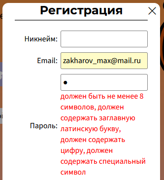

### 2. Доступ к карточке по ссылке

<h4 id="201">Баг 201 - Ошибка в отображении тегов</h4>
Описание - при попытке доступа к карточке по ссылке стороннего пользователя (который не имеет прав доступа к доске), не отображается тег, навешенный на карточку - вместо него "Ошибка"<br>
- Ожидаемый результат: в карточке в разделе Теги, при наличии выставленных тегов, отображается круглая цветовая метка и название Тега<br>
- Фактический результат: в карточке в разделе Теги, при наличии выставленных тегов, отображается слово "Ошибка"<br>

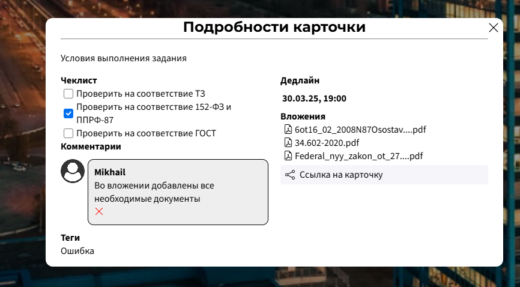<br>

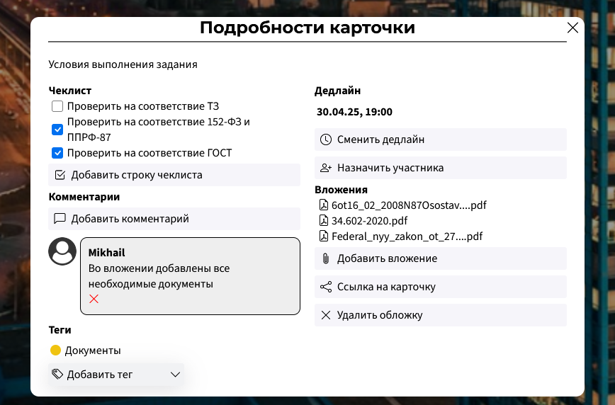<br>

### 3. Drag-n-Drop

<h4 id="301">Баг 301 - Ошибка при захвате карточки и попытке постаить ее на исходное место</h4>
- Ожидаемый результат: после того, как пользователь захватил карточку, не отпуская захват мыши поводил по экрану, а затем опустил в исходное место, карточка должна расположиться на исходную позицию<br>
- Фактический результат: карточка располагается на исходную позицию, но появляется alert "Неизвестная ошибка", ошибка 500 в сети<br>

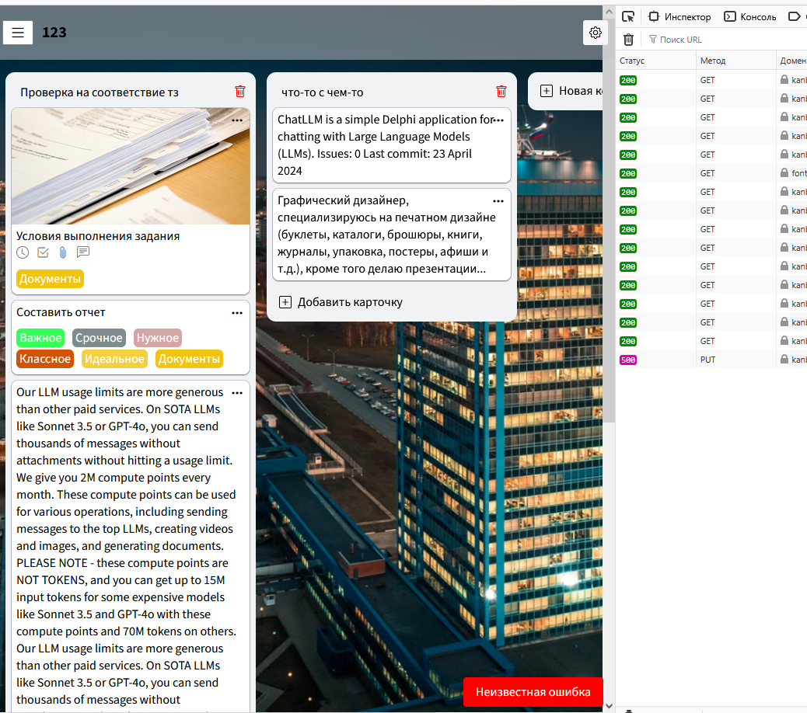<br>

### 4. Назначить пользователя на карточку

<h4 id="401">Баг 401 - Удаление последнего назначенного лица из карточки</h4>


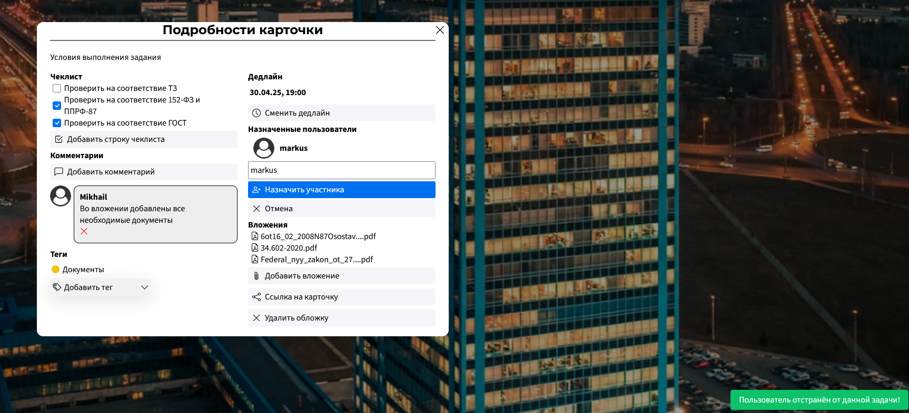
При попытке удалить последнего назначенного пользователя из карточки, данный пользователь перестает отображаться в назначенных только после выхода из карточки и повторного захода в нее. Если проделывать данную процедуру с несколькими пользователями (более одного участника в списке), все они удаляются сразу, пока не останется последний.

### 5. Полнотекстоввый поиск

### 6. Добавление участников на доску (по ссылке)

### 7. Чеклист

<h4 id="701">Некорректное поведение при создании строки чеклиста при превышении длины строки</h4>
Чеклист создается с любым количеством символов, но отображаются только первые 40. Ожидается, что нельзя создать чеклист с название больше 30 символов.


### 8. Режим списка, переключалка

### 9. Вложения

### 10. Доски (левая панель)

### 11. Комментарии

<h4 id="1101">Баг 1101</h4>
Комментарий удаляется, но из карточки пропадает только после перезагрузки страницы, при повторном удалении пишет ошибку. Ожидается, что после удаления комментарий перестанет отображаться сразу.


<h4 id="1102">Баг 1102</h4>
Нет ограничений на размер вводимого комментария. Ввела +80000 символов. Ожидается ограничение ввода.

### 12. Назначение тега на карточку

<h4 id="1201">Баг 1201</h4>
Один и тот же тег можно добавлять несколько раз. Ожидается, что каждый тег добавляется один раз.


<h4 id="1202">Баг 1202</h4>
При повторном добавлении тега на колонку выводится ошибка. Ожидается конкретный текст ошибки.


### 13. Смена аватарки пользователя

<h4 id="1301">Баг 1301</h4>
Позволяет загружать svg формат, но некорректно отображает его. Ожидается либо ограничение данного типа, либо корректное отображение.


<h4 id="1302">Баг 1302</h4>
Нет проверки на содержимое файла, проверяется только его расширение, получилось загрузить pdf файл после замены его расширения. Ожидается сообщение об ошибке
<h4 id="1303">Баг 1303</h4>
Загрузила файл размером 205Мб, выдал неизвестную ошибку. Ожидается сообщение о превышении допустимого размера файла


### 14. Создание, изменение и удаление колонок и карточек

<h4 id="1401">Баг 1401</h4>
Нет ограничений на количество вводимых символов в текст карточки. Смогла ввести +80000 симоволов. Ожидается ограничение на размер вводимых данных
<h4 id="1402">Баг 1402</h4>
Рамка поля редактирования и поля карточки не совпадает. Ожидаются одинаковые поля


<h4 id="1403">Баг 1403</h4>
Дублируется уведлмление о удалении. Ожидается одно уведомление


<h4 id="1404">Баг 1404</h4>
Поле редактирования вылезает за поля колонки при большом вводе. Ожидается фиксированный размер поля редактирования(меньший чем размер колонки)


<h4 id="1405">Баг 1405</h4>
Размер поля редактирования меняется при наведении и при нажатии. Ожидается фиксированный размер

 

<h4 id="1406">Баг 1406</h4>
При редактировании стирается часть первой буквы, даже если все буквы помещаются в колонку. Ожидается, что все буквы будет видно полностью, если размеры поля ввода меньше размеров колонки.


<h4 id="1407">Баг 1407</h4>
При введении  нескольких пробелов карточка успешно создается. Ожидается ошибка


### 15. Задание фона доски

<h4 id="1501">Баг 1501</h4>
Позволяет загружать svg формат, но некорректно отображает его. Ожидается либо ограничение данного типа, либо корректное отображение.


<h4 id="1502">Баг 1502</h4>
Нет проверки на содержимое файла, проверяется только его расширение, получилось загрузить pdf файл после замены его расширения. Ожидается сообщение об ошибке
<h4 id="1503">Баг 1503</h4>
Загрузила файл размером 205Мб, выдал неизвестную ошибку. Ожидается сообщение о превышении допустимого размера файла


### 16. Управление тега

<h4 id="1601">При добавлении тега поле ввода не закрывается</h4>

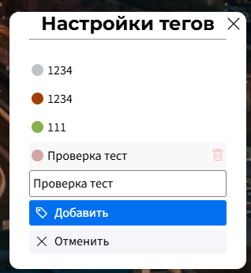

Ожидаемое поведение: после добавления тега поле ввода должно очищаться и закрываться.

Фактическое поведение: после добавления тега поле ввода остаётся в фокусе, не
закрывается, в нём остаётся введёный ранее текст.

### 17. Дедлайн карточки

<h4 id="1701">Некорректное поведение при добавлении дедлайна и неполном вводе</h4>

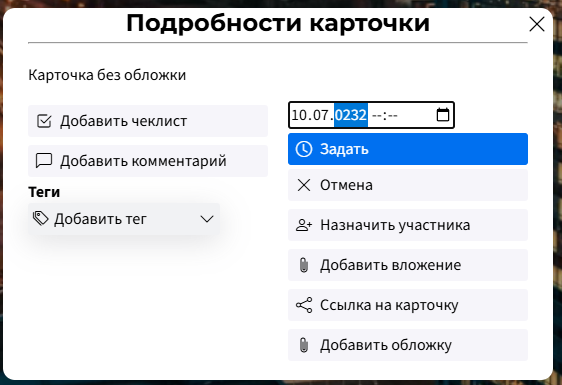

Ожидаемое поведение: при неполном вводе должна быть показана ошибка. Также поле ввода не
должно очищаться или закрываться, фокус не должен быть потерян.

Фактическое поведение: при неполном вводе показывается Toast-сообщение с текстом "Успешно
задан дедлайн". Также закрывается и очищается поле ввода. Но дедлайн на карточке не появляется.
При этом сервер возвращает код 200. На сервер отправляется PATCH-запрос с JSON-кой:

```json
{deadline: null}
```

<h4 id="1702">Не работает удаление дедлайна</h4>

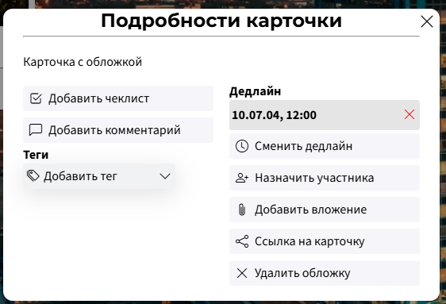

Ожидаемое поведение: при нажатии на красный крестик с карточки удаляется дедлайн, показывается
Toast-сообщение.

Фактическое поведение: при нажатии на красный крестик ничего не происходит. Запрос на сервер
не выполняется. Никаких сообщений не выводится.

### 18. Обложки

<h4 id="1801">Некорректное поведение при попытке назначить в качестве обложки не изображение или изображение
размером свыше 10 Мб</h4>

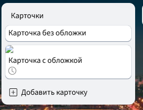

Ожидаемое поведение: если загрузить обложку с расширением, не характерным для растрового изображения,
или изображение размером свыше 10 Мб, должна быть выведена ошибка. Обложка не должна быть добавлена.

Фактическое поведение: Обложка устанавливается для размера файла 90 Мб. При установке в качестве обложки
файла с расширением MP4 ошибка не происходит; в качестве обложки отображается символ битого изображения.

### 19. Переименование доски

<h4 id="1901">Двойная отправка запроса на переименование доски при нажатии клавиши Enter в поле
ввода названия доски</h4>

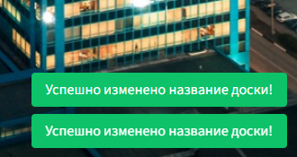

Ожидаемое поведение: при переименовании доски при нажатии на Enter отправляется один
запрос на переименование

Фактическое поведение: отправляется два запроса.

<h4 id="1902">Отправка запроса на переименовании при отсутствии изменений</h4>

Ожидаемое поведение: если содержимое поля с названием доски не изменилось, запрос не
отправляется

Фактическое поведение: запрос отправляется, даже если название доски не изменилось

### 20. Настройки профиля

<h4 id="2001">Некорректная обработка ошибок при смене пароля</h4>

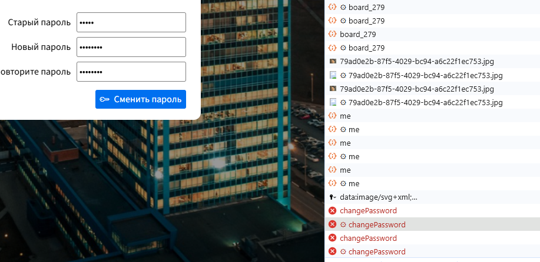

Ожидаемое поведение: при попытке смены пароля производится проверка пароля в соответствии с правилами валидации. При выявлении ошибок выводится Toast-сообщение
со списком всех выявленных ошибок.

Фактическое поведение: проверяется только длина пароля.

### 21. Нефункциональные проверки

Едет верстка поиска при расширении экрана 820 \* 1180

